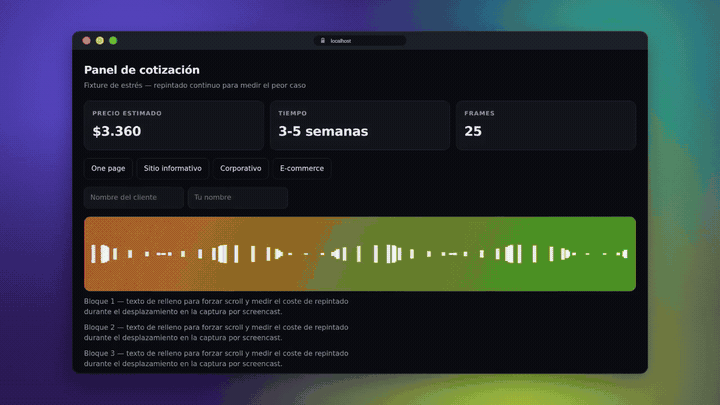
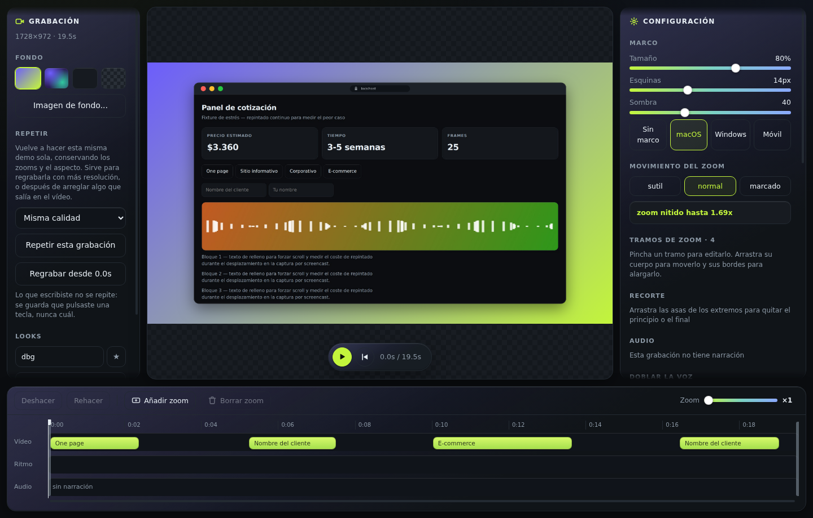

<div align="center">

# Vitrina

**Product demos of your web app, with automatic zoom on every click.**
An open source alternative to Screen Studio, for Windows and macOS.

[Download](https://github.com/Juan1Meza2308/vitrina/releases/latest) ·
[Docs](docs/) ·
[Español](README.es.md)



</div>

## Why it exists

Vitrina records **web pages**, not your screen. It opens your app in a clean
window and captures the browser's own compositor through the Chrome DevTools
Protocol. That one constraint is where everything else comes from:

- **Clicks carry the element's rectangle.** The camera frames the actual button
  or form you clicked, not a guessed radius around the cursor.
- **Frames have no system cursor.** It is drawn afterwards — smoothed, constant
  in size while zoomed, with a ripple on every click.
- **Nothing to sync.** Frames and the input log share one clock.

And a privacy guarantee a screen recorder cannot make: the keyboard log records
`"char"`, never the key. A demo of a login screen cannot leak a password. What
you mask is blurred **while recording**, so it never exists in the video.

> It does not capture your desktop, your editor, or a video call. If that is what
> you need, this is the wrong tool — and that is a deliberate trade.

## Install

Download the installer from
[Releases](https://github.com/Juan1Meza2308/vitrina/releases/latest) — `.exe` for
Windows, `.dmg` for macOS — and open it. FFmpeg ships inside, so there is nothing
else to install.

The app is not code-signed (that needs a paid developer account on both
platforms), so the first launch shows a warning: on Windows, *More info → Run
anyway*; on macOS, right-click → *Open*.

<details>
<summary>Or run it from source</summary>

```bash
git clone https://github.com/Juan1Meza2308/vitrina.git
cd vitrina
npm install
npm run app
```

Needs Node 22.18+ and a Chromium browser (Edge is already there on Windows).

</details>

## Your first demo

1. **Type your app's URL** and hit Record. A clean browser window opens — no
   tabs, no address bar.
2. **Do the demo.** Click around, scroll, type. Vitrina is watching the elements
   you touch, not just the pixels.
3. **Stop**, and you land in the editor with the zooms already planned. Drag them,
   stretch them, change the background, and export.



## What it does

|  |  |
|---|---|
| **Automatic camera** | Plans the zooms from what you clicked, and lets you edit every one of them |
| **Cinematic backgrounds** | Gradients, mesh, solid, your own image, or transparent |
| **Vertical** | A real mobile viewport for TikTok, Reels and Shorts — not a cropped desktop |
| **Narration** | Record your voice, cut the silences automatically, or dub it afterwards |
| **Webcam bubble** | Your face in a corner, sized and placed where you want it |
| **Speed up the waiting** | Loading spinners and dead air compressed, audio kept in sync |
| **Mask sensitive data** | CSS selectors blurred *while recording* — a balance, an email, a real name |
| **Redo just a piece** | Re-record from any point, keeping everything before it |
| **Self-documenting** | Exports a written guide of the demo, with a screenshot per step |
| **Export** | MP4, WebM, GIF, and ProRes with alpha |

## Docs

Written in Spanish, which is the language of the codebase.

- [Grabar](docs/grabar.md) — quality, vertical mode, backgrounds
- [El editor](docs/editor.md) — timeline, undo, looks, watermark
- [Narración, cámara y rehacer trozos](docs/narracion-y-camara.md)
- [Privacidad](docs/privacidad.md) — what is recorded and what is not
- [Cómo está hecho](docs/arquitectura.md) — camera, compositor, exporter
- [Desarrollo](docs/desarrollo.md) — running, verifying, packaging

## Contributing

Issues and pull requests are welcome — see [CONTRIBUTING.md](CONTRIBUTING.md).

The project has one rule worth knowing before you send code: **what the code
claims, the code measures**. Performance comments come with numbers, and the
measurements live in [`spikes/HALLAZGOS.md`](spikes/HALLAZGOS.md) — including the
ones that proved a good-sounding idea wrong.

## License

[MIT](LICENSE). The installers bundle FFmpeg (GPL), unmodified and run as a
separate process — see [THIRD-PARTY.md](THIRD-PARTY.md).
